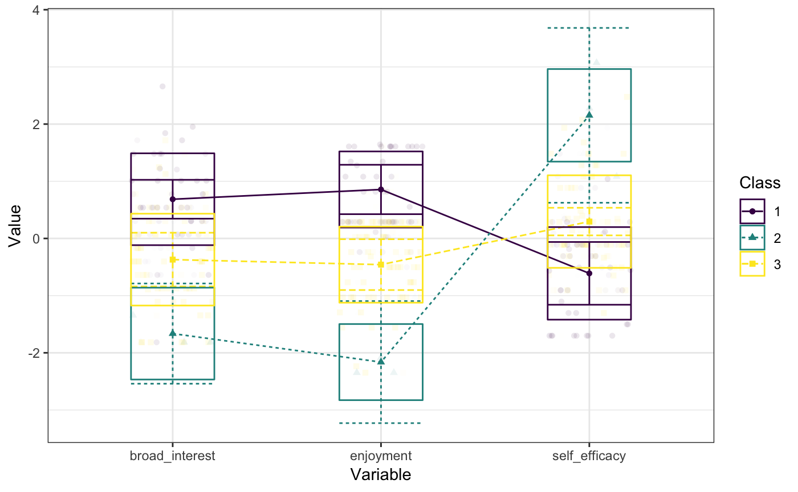

<!-- README.md is generated from README.Rmd. Please edit that file -->
tidyLPA
=======

[](https://travis-ci.org/jrosen48/tidyLPA) [](https://cran.r-project.org/package=tidyLPA)

Latent Profile Analysis (LPA) is a statistical modeling approach for estimating distinct profiles, or groups, of variables. In the social sciences and in educational research, these profiles could represent, for example, how different youth experience dimensions of being engaged (i.e., cognitively, behaviorally, and affectively) at the same time.

tidyLPA provides the functionality to carry out LPA. LPA is a statistical modeling approach for estimating parameters (i.e., the means, variances, and covariances) for profiles. Note that tidyLPA is still at the beta stage! Please report any bugs at <https://github.com/jrosen48/tidyLPA> or send an email to <jrosen@msu.edu>.

Installation
------------

You can install tidyLPA from CRAN with:

``` r
install.packages("tidyLPA")
```

You can also install the in-development version of tidyLPA from GitHub with:

``` r
install.packages("devtools")
devtools::install_github("jrosen48/tidyLPA")
```

Example
-------

Here is a brief example using the built-in `pisaUSA15` dataset and variables for broad interest, enjoyment, and self-efficacy. Note that we first type the name of the data frame, followed by the unquoted names of the variables used to create the profiles. We also specify the number of profiles and the model. See `?estimate_profiles` for more details.

``` r
library(tidyLPA)
#> tidyLPA provides the functionality to carry out Latent Profile Analysis. Note that tidyLPA is still at the beta stage! 
#> Please report any bugs at https://github.com/jrosen48/tidyLPA or send an email to jrosen@msu.edu.
```

``` r
d <- pisaUSA15[1:100, ]

m3 <- estimate_profiles(d, 
                        broad_interest, enjoyment, self_efficacy, 
                        n_profiles = 3, 
                        model = 2)
#> Fit varying means, equal variances and covariances (Model 2) model with 3 profiles.
#> LogLik is 279.692
#> BIC is 636.62
#> Entropy is 0.798
```

The `model` argument allows for four models to be specified:

-   Varying means, equal variances, and covariances fixed to 0 (model 1)
-   Varying means, equal variances, and equal covariances (model 2)
-   Varying means, varying variances, and covariances fixed to 0 (model 3)
-   Varying means, varying variances, and varying covariances (model 6)

Two additional models can be fit using functions that provide an interface to the MPlus software. More information on the models can be found in the [vignette](https://jrosen48.github.io/tidyLPA/articles/Introduction_to_tidyLPA.html).

The output, saved to the object \`m3, is a data frame with the variable selected with the profile with the highest posterior probability (and the probability) added.

``` r
m3
#> # A tibble: 94 x 5
#>    broad_interest enjoyment self_efficacy profile posterior_prob
#>             <dbl>     <dbl>         <dbl> <fct>            <dbl>
#>  1           3.80      4.00          1.00 1                0.976
#>  2           3.00      3.00          2.75 2                0.847
#>  3           1.80      2.80          3.38 2                0.982
#>  4           1.40      1.00          2.75 3                0.963
#>  5           1.80      2.20          2.00 3                0.824
#>  6           1.60      1.60          1.88 3                0.960
#>  7           3.00      3.80          2.25 1                0.847
#>  8           2.60      2.20          2.00 3                0.704
#>  9           1.00      2.80          2.62 3                0.584
#> 10           2.20      2.00          1.75 3                0.861
#> # ... with 84 more rows
```

We can easily plot the profiles using `plot_profiles()`:

``` r
plot_profiles(m3, to_center = TRUE)
```



More information
----------------

To learn more:

-   Browse the tidyLPA [website](https://jrosen48.github.io/tidyLPA/)

-   *Read the Introduction to tidyLPA* [vignette](https://jrosen48.github.io/tidyLPA/articles/Introduction_to_tidyLPA.html), which has much more information on the models that can be specified with tidyLPA and on additional functionality

Contact
-------

As tidyLPA is at an early stage of its development, issues should be expected. If you have any questions or feedback, please do not hesitate to get in touch:

-   By [email (jrosen@msu.edu)](mailto:jrosen@msu.edu)
-   By [Twitter](http://twitter.com/jrosenberg6432)
-   Through filing an issue on GitHub [here](https://github.com/jrosen48/tidyLPA)

Please note that this project is released with a [Contributor Code of Conduct](CONDUCT.md). By participating in this project you agree to abide by its terms.
