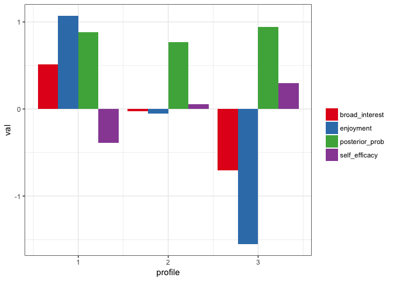
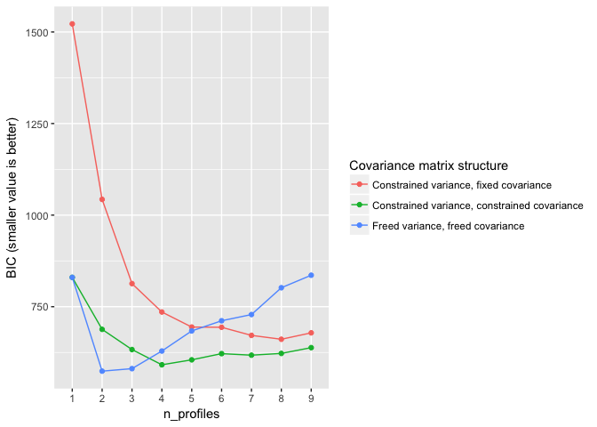

<!-- README.md is generated from README.Rmd. Please edit that file -->
tidyLPA
=======

The goal of `tidyLPA` is to provide tools to make it easier to use the `R` package [MCLUST](http://www.stat.washington.edu/mclust/) for Latent Profile Analysis analyses.

This is a sister-project to [prcr](https://github.com/jrosen48/prcr), for two-step cluster analysis. tidyLPA (which, again, is an interface to the `MCLUST` package) has been benchmarked to MPlus, at least for a simple dataset (the [iris dataset](https://en.wikipedia.org/wiki/Iris_flower_data_set)). You can find the results of that benchmarking, which showed the results to be nearly, identical, [here](https://jrosen48.github.io/blog/comparing-mplus-and-mclust-output/).

Example
=======

First, we can explore the Bayesian Information Criteria (BIC) or the Integrated Complete-data Likelihood (ICL) values, using the `explore_models_clust()` function:

``` r
library(tidyLPA)
```

Using the built-in `pisaUSA15` dataset and variables for broad interest, instrumental motivation, and self-efficacy, we can quickly explore a three profile solution:

``` r
d <- pisaUSA15
m3 <- create_profiles_lpa(d, broad_interest, instrumental_mot, self_efficacy, n_profiles = 3, model = 2)
#> Model with 3 profiles using the 'varying means, equal variances and covariances' model.
#> Model AIC is 34679.893
#> Model BIC is 34791.889
#> Model ICL is 39511.702
plot_profiles_lpa(m3, to_center = TRUE)
#> Warning: attributes are not identical across measure variables;
#> they will be dropped
```



We can also extract the posterior probabilities by setting `return_posterior_probs` to `TRUE`:

``` r
m3 <- create_profiles_lpa(d, broad_interest, instrumental_mot, self_efficacy, n_profiles = 3, model = 2, return_posterior_probs = TRUE)
#> Model with 3 profiles using the 'varying means, equal variances and covariances' model.
#> Model AIC is 34679.893
#> Model BIC is 34791.889
#> Model ICL is 39511.702
m3
#> # A tibble: 5,367 x 5
#>    broad_interest instrumental_mot self_efficacy profile posterior_prob
#>  *          <dbl>            <dbl>         <dbl>   <dbl>          <dbl>
#>  1            3.8             2.00         1.000       2        0.51205
#>  2            3.0             2.50         2.750       2        0.63810
#>  3            1.8             3.50         3.375       2        0.80200
#>  4            1.4             2.75         2.750       2        0.81043
#>  5            1.8             2.00         2.000       2        0.74737
#>  6            1.6             2.75         1.875       2        0.79362
#>  7            3.0             1.25         2.250       2        0.57589
#>  8            2.6             2.00         2.000       2        0.66186
#>  9            1.0             1.00         2.625       2        0.78366
#> 10            2.2             1.00         1.750       2        0.65999
#> # ... with 5,357 more rows
```

See `?create_profiles_lpa` for a description of the models; model `2` as specified in this example is for a model with varying means but equal variances and covariances across profiles.

We can also explore a range of models (here using the built-in `iris` dataset, as this function takes longer to run with larger datasets):

``` r
d <- iris
compare_models_lpa(d, Sepal.Length, Sepal.Width, Petal.Length, Petal.Width)
```


