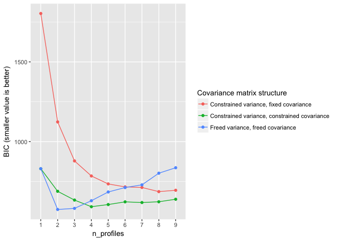

tidymixmod
==========

The (present, possibly changing) goal of tidymixmod is to provide tools to make it easier to use MCLUST for latent profile analysis-like analyses.

This is a sister-project to [prcr](https://github.com/jrosen48/prcr), for two-step cluster analysis, and may be merged with it in the future.

A candidate feature or change is to (also? in addition to its present functionality?) provide an interface to the general latent variable model software OpenMx to carry out Latent Profile Analysis (LPA) and Latent Class Analysis (LCA), as while presently MCLUST provides great functionality, it does not work with categorical variables, and therefore cannot be used to carry out LCA.

Example
=======

First, we can explore the Bayesian Information Criteria (BIC) or the Integrated Complete-data Likelihood (ICL) values, using the `explore_models_clust()` function:

``` r
library(dplyr)
```

    ## 
    ## Attaching package: 'dplyr'

    ## The following objects are masked from 'package:stats':
    ## 
    ##     filter, lag

    ## The following objects are masked from 'package:base':
    ## 
    ##     intersect, setdiff, setequal, union

``` r
library(tidymixmod)
df <- select(iris, -Species)
explore_models_mclust(df)
```



We can then specify a model, using either character strings for the variance and covariance\_structure:

``` r
m_free_3 <- create_profiles_mclust(df, n_profiles = 3, variance_structure = "freed", covariance_structure = "freed")
m_free_3
```

    ## # A tibble: 3 x 5
    ##     profile Sepal.Length Sepal.Width Petal.Length Petal.Width
    ## *     <chr>        <dbl>       <dbl>        <dbl>       <dbl>
    ## 1 Profile 1       -1.011       0.850       -1.301      -1.251
    ## 2 Profile 2        0.074      -0.646        0.247       0.123
    ## 3 Profile 3        0.859      -0.244        0.981       1.036

Or an MClust model name:

``` r
m_free_3 <- create_profiles_mclust(df, n_profiles = 3, model_name = "VVV")
m_free_3
```

    ## # A tibble: 3 x 5
    ##     profile Sepal.Length Sepal.Width Petal.Length Petal.Width
    ## *     <chr>        <dbl>       <dbl>        <dbl>       <dbl>
    ## 1 Profile 1       -1.011       0.850       -1.301      -1.251
    ## 2 Profile 2        0.074      -0.646        0.247       0.123
    ## 3 Profile 3        0.859      -0.244        0.981       1.036

If we like, we can carry out a test for the number of mixture components, using a bootstrapped likelihood-ratio test. Here, we are testing for the freed variance, freed covariance model (nboot is set to 100 so that this runs more quickly for illustrative purposes):

``` r
bootstrap_LRT_mclust(df, model_names = c("VVV"), nboot = 100)
```

    ## Bootstrap sequential LRT for the number of mixture components
    ## -------------------------------------------------------------
    ## Model        = VVV 
    ## Replications = 100 
    ##               LRTS bootstrap p-value
    ## 1 vs 2   331.11985        0.00990099
    ## 2 vs 3    68.33750        0.00990099
    ## 3 vs 4    27.03438        0.57425743

We can also provide a list of models, such as the constrained variance, fixed covariance model and the freed variance, freed covariance model, from the example above:

``` r
bootstrap_LRT_mclust(df, model_names = c("EEE", "VVV"), nboot = 100)
```

    ## [[1]]
    ## Bootstrap sequential LRT for the number of mixture components
    ## -------------------------------------------------------------
    ## Model        = EEE 
    ## Replications = 999 
    ##               LRTS bootstrap p-value
    ## 1 vs 2   166.93411             0.001
    ## 2 vs 3    80.18463             0.001
    ## 3 vs 4    66.60928             0.001
    ## 4 vs 5    11.53298             0.131
    ## 
    ## [[2]]
    ## Bootstrap sequential LRT for the number of mixture components
    ## -------------------------------------------------------------
    ## Model        = VVV 
    ## Replications = 999 
    ##               LRTS bootstrap p-value
    ## 1 vs 2   331.11985             0.001
    ## 2 vs 3    68.33750             0.001
    ## 3 vs 4    27.03438             0.612

We can easily extract the classifications from the posterior probabilities:

``` r
classifications <- extract_mclust_classifications(m_free_3)
classifications
```

    ##   [1] 1 1 1 1 1 1 1 1 1 1 1 1 1 1 1 1 1 1 1 1 1 1 1 1 1 1 1 1 1 1 1 1 1 1 1
    ##  [36] 1 1 1 1 1 1 1 1 1 1 1 1 1 1 1 2 2 2 2 2 2 2 2 2 2 2 2 2 2 2 2 2 2 3 2
    ##  [71] 3 2 3 2 2 2 2 3 2 2 2 2 2 3 2 2 2 2 2 2 2 2 2 2 2 2 2 2 2 2 3 3 3 3 3
    ## [106] 3 3 3 3 3 3 3 3 3 3 3 3 3 3 3 3 3 3 3 3 3 3 3 3 3 3 3 3 3 3 3 3 3 3 3
    ## [141] 3 3 3 3 3 3 3 3 3 3

Please provide feedback and follow along.
