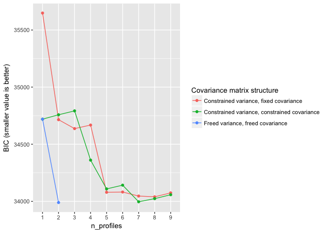

<!-- README.md is generated from README.Rmd. Please edit that file -->
tidyLPA
=======

The goal of `tidyLPA` is to provide tools to make it easier to use the `R` package [MCLUST](http://www.stat.washington.edu/mclust/) for Latent Profile Analysis analyses.

This is a sister-project to [prcr](https://github.com/jrosen48/prcr), for two-step cluster analysis.

tidyLPA (which, again, is an interface to the `MCLUST` package) has been benchmarked to MPlus, at least for a simple dataset (the [iris dataset](https://en.wikipedia.org/wiki/Iris_flower_data_set)). You can find the results of that benchmarking, which showed the results to be nearly, identical, [here](https://jrosen48.github.io/blog/comparing-mplus-and-mclust-output/).

Example
=======

First, we can explore the Bayesian Information Criteria (BIC) or the Integrated Complete-data Likelihood (ICL) values, using the `explore_models_clust()` function:

    #> Loading tidyLPA

``` r
library(tidyLPA)
```

Using the built-in `pisaUSA15` dataset and variables for broad interest, instrumental motivation, and self-efficacy, we can quickly explore a three profile solution:

``` r
d <- pisaUSA15
m3 <- create_profiles_mclust(d, broad_interest, instrumental_mot, self_efficacy, n_profiles = 3, to_return = "tibble")
#> Fit model with 3 profiles using the 'constrained variance' model.
#> Model BIC is 34636.654
summary_mclust(m3)
#> # A tibble: 3 x 4
#>   profile broad_interest instrumental_mot self_efficacy
#>     <dbl>          <dbl>            <dbl>         <dbl>
#> 1       1       3.576766         1.458378      1.575340
#> 2       2       1.400114         2.529300      2.628835
#> 3       3       2.719294         2.121035      2.159403
plot_profiles_mclust(m3)
```


We can also explore a range of models:

``` r
explore_models_mclust(d, broad_interest, instrumental_mot, self_efficacy)
#> # A tibble: 5,367 x 3
#>    broad_interest instrumental_mot self_efficacy
#>             <dbl>            <dbl>         <dbl>
#>  1            3.8             2.00         1.000
#>  2            3.0             2.50         2.750
#>  3            1.8             3.50         3.375
#>  4            1.4             2.75         2.750
#>  5            1.8             2.00         2.000
#>  6            1.6             2.75         1.875
#>  7            3.0             1.25         2.250
#>  8            2.6             2.00         2.000
#>  9            1.0             1.00         2.625
#> 10            2.2             1.00         1.750
#> # ... with 5,357 more rows
#> Warning: Removed 7 rows containing missing values (geom_path).
#> Warning: Removed 7 rows containing missing values (geom_point).
```


