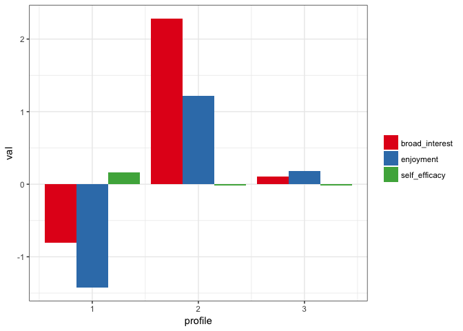

<!-- README.md is generated from README.Rmd. Please edit that file -->
tidyLPA
=======

The goal of `tidyLPA` is to provide tools to make it easier to use the `R` package [MCLUST](http://www.stat.washington.edu/mclust/) for Latent Profile Analysis analyses.

This is a sister-project to [prcr](https://github.com/jrosen48/prcr), for two-step cluster analysis. tidyLPA (which, again, is an interface to the `MCLUST` package) has been benchmarked to MPlus, at least for a simple dataset (the [iris dataset](https://en.wikipedia.org/wiki/Iris_flower_data_set)). You can find the results of that benchmarking, which showed the results to be nearly, identical, [here](https://jrosen48.github.io/blog/comparing-mplus-and-mclust-output/).

Example
=======

Here is a brief example using the built-in `pisaUSA15` dataset and variables for broad interest, enjoyment, and self-efficacy. See `?create_profiles_lpa` for more details.

Also, please view the [Introduction to tidyLPA vignette](https://jrosen48.github.io/tidyLPA/articles/Introduction_to_tidyLPA.html) for more information.

``` r
library(tidyLPA)
```

``` r
library(dplyr)
#> 
#> Attaching package: 'dplyr'
#> The following objects are masked from 'package:stats':
#> 
#>     filter, lag
#> The following objects are masked from 'package:base':
#> 
#>     intersect, setdiff, setequal, union
d <- pisaUSA15
d <- sample_frac(d, .5)
m3 <- create_profiles_lpa(d, broad_interest, enjoyment, self_efficacy, n_profiles = 3, model = 2)
#> Model with 3 profiles using the 'varying means, equal variances and covariances' model.
#> AIC is 16011.594
#> BIC is 16111.835
#> ICL is 16527.187
#> Entropy is 0.93277
m3
#> # A tibble: 2,688 x 5
#>    broad_interest enjoyment self_efficacy profile posterior_prob
#>             <dbl>     <dbl>         <dbl>   <dbl>          <dbl>
#>  1            2.6      2.80         2.000       1        0.98962
#>  2            2.6      2.20         2.750       1        0.96593
#>  3            2.8      2.75         2.000       1        0.99444
#>  4            2.6      2.40         2.625       1        0.99542
#>  5            1.4      2.60         2.000       1        0.98905
#>  6            2.0      3.00         3.000       1        0.92196
#>  7            3.6      3.80         1.000       3        0.89234
#>  8            2.4      2.60         2.500       1        0.99712
#>  9            2.6      2.80         2.000       1        0.98962
#> 10            2.0      2.40         2.875       1        0.99787
#> # ... with 2,678 more rows
plot_profiles_lpa(m3, to_center = TRUE)
```


